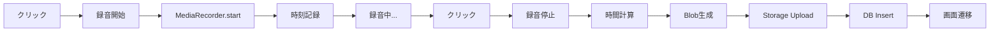

# 🎙️ IRIS - Intelligent Recording & Interactive System

音声対話型インターフェース | Voice-Interactive Discussion Platform

<div align="center">

[](https://nextjs.org/)
[](https://www.typescriptlang.org/)
[](https://supabase.com/)
[](https://react.dev/)

**リアルタイム音声録音・解析・保存を実現する次世代対話プラットフォーム**

[🚀 クイックスタート](#クイックスタート) • [📚 ドキュメント](#ドキュメント) • [🎨 機能](#主要機能) • [🔧 セットアップ](#セットアップ)

</div>

---

## 📖 目次

- [概要](#概要)
- [主要機能](#主要機能)
- [技術スタック](#技術スタック)
- [クイックスタート](#クイックスタート)
- [セットアップ](#セットアップ)
- [プロジェクト構造](#プロジェクト構造)
- [主要コンポーネント](#主要コンポーネント)
- [データベース設計](#データベース設計)
- [API・機能](#api機能)
- [開発ガイド](#開発ガイド)
- [トラブルシューティング](#トラブルシューティング)
- [貢献](#貢献)
- [ライセンス](#ライセンス)

---

## 🎯 概要

**IRIS（Intelligent Recording & Interactive System）** は、音声録音とリアルタイム視覚化を組み合わせた革新的な対話プラットフォームです。美しい3D球体UIで音声入力を視覚化し、録音データを安全にクラウドに保存します。

### 🌟 特徴

- 🎨 **美しい3Dビジュアライゼーション** - 音量に反応して動く球体UI
- 🎙️ **高品質音声録音** - MediaRecorder APIによる録音
- ⏱️ **精密な時間追跡** - ミリ秒単位の録音時間管理
- ☁️ **クラウドストレージ** - Supabaseによる安全なデータ保存
- 🔒 **セキュアな認証** - Row Level Security (RLS) による保護
- 📊 **Discussion管理** - 録音履歴の一覧・検索・再生
- 🎭 **レスポンシブデザイン** - デスクトップ・モバイル対応

---

## ✨ 主要機能

### 1. 🎙️ 音声録音システム

```typescript
// 録音開始から保存まで自動化
<RecordingWithIris 
  width={600} 
  height={600}
  onRecordingChange={(isRecording) => console.log(isRecording)}
/>
```

**機能:**
- ワンクリック録音開始・停止
- リアルタイム音声レベル検出
- WebM形式で高品質保存
- 自動的なSupabaseアップロード

### 2. 🌐 3D球体ビジュアライゼーション

- **2000個の粒子** による球体構成
- **黄金螺旋アルゴリズム** で均等分布
- **音量連動** - リアルタイムで振動・膨張
- **色変化** - 待機時（シアン）→ 録音時（赤）
- **回転制御** - 待機時は回転、録音時は停止

### 3. ⏱️ 録音時間追跡

```typescript
// 精密な時間管理
録音開始 → Date.now() 記録
録音停止 → 経過時間計算（ミリ秒精度）
DB保存 → duration_seconds フィールド
```

### 4. 📂 ファイル管理システム

**フォルダ構造:**
```
audio-recordings/
├── {user_id_1}/
│   ├── recording_1234567890.webm
│   └── recording_1234567891.webm
└── {user_id_2}/
    └── recording_1234567892.webm
```

**セキュリティ:**
- ユーザーIDベースのフォルダ分離
- RLS Policiesによるアクセス制御
- 署名付きURL（期限付き）

### 5. 💬 Discussion機能

- 録音履歴の一覧表示
- 作成日時でソート
- クリックで詳細ページへ遷移
- サイドバーでクイックアクセス

---

## 🛠️ 技術スタック

### Frontend

| 技術 | バージョン | 用途 |
|------|-----------|------|
| **Next.js** | 15.x | Reactフレームワーク |
| **TypeScript** | 5.x | 型安全な開発 |
| **Framer Motion** | 11.x | アニメーション |
| **Tailwind CSS** | 3.x | スタイリング |

### Backend & Infrastructure

| 技術 | 用途 |
|------|------|
| **Supabase** | データベース・認証・ストレージ |
| **PostgreSQL** | リレーショナルDB |
| **Storage** | 音声ファイル保存 |
| **Auth** | ユーザー認証 |

### Web APIs

| API | 用途 |
|-----|------|
| **MediaRecorder** | 音声録音 |
| **getUserMedia** | マイクアクセス |
| **AudioContext** | 音声解析・視覚化 |
| **AnalyserNode** | 周波数データ取得 |
| **Canvas** | 3D描画 |

---

## 🚀 クイックスタート

### 前提条件

- Node.js 18.x 以上
- npm または yarn
- Supabaseアカウント

### インストール

```bash
# リポジトリのクローン
git clone https://github.com/yourusername/iris.git
cd iris

# フロントエンドディレクトリへ移動
cd frontend

# 依存関係のインストール
npm install

# 環境変数の設定
cp .env.example .env
# .env ファイルを編集

# 開発サーバーの起動
npm run dev
```

ブラウザで http://localhost:3000 を開く

---

## 🔧 セットアップ

### 1. Supabase設定

#### Storage バケット作成

```sql
-- Supabaseダッシュボード → Storage → New bucket

名前: audio-recordings
Public: OFF (重要)
File size limit: 52428800 (50MB)
Allowed MIME types: audio/webm, audio/mp4, audio/ogg
```

#### Storage Policies

```sql
-- アップロード権限
CREATE POLICY "Users can upload their own recordings"
ON storage.objects 
FOR INSERT 
TO authenticated
WITH CHECK (
  bucket_id = 'audio-recordings' 
  AND (storage.foldername(name))[1] = auth.uid()::text
);

-- 読み取り権限
CREATE POLICY "Users can read their own recordings"
ON storage.objects 
FOR SELECT 
TO authenticated
USING (
  bucket_id = 'audio-recordings' 
  AND (storage.foldername(name))[1] = auth.uid()::text
);
```

#### Database テーブル作成

```sql
-- discussions テーブル
CREATE TABLE discussions (
  id UUID DEFAULT gen_random_uuid() PRIMARY KEY,
  user_id UUID NOT NULL REFERENCES auth.users(id) ON DELETE CASCADE,
  audio_file_path TEXT NOT NULL,
  duration_seconds INTEGER NOT NULL,
  title TEXT,
  description TEXT,
  status TEXT DEFAULT 'active' CHECK (status IN ('active', 'archived', 'deleted')),
  created_at TIMESTAMP WITH TIME ZONE DEFAULT NOW(),
  updated_at TIMESTAMP WITH TIME ZONE DEFAULT NOW()
);

-- インデックス
CREATE INDEX idx_discussions_user_id ON discussions(user_id);
CREATE INDEX idx_discussions_created_at ON discussions(created_at DESC);

-- RLS有効化
ALTER TABLE discussions ENABLE ROW LEVEL SECURITY;

-- RLS Policies
CREATE POLICY "Users can create their own discussions"
ON discussions FOR INSERT TO authenticated
WITH CHECK (auth.uid() = user_id);

CREATE POLICY "Users can read their own discussions"
ON discussions FOR SELECT TO authenticated
USING (auth.uid() = user_id);

CREATE POLICY "Users can update their own discussions"
ON discussions FOR UPDATE TO authenticated
USING (auth.uid() = user_id)
WITH CHECK (auth.uid() = user_id);

CREATE POLICY "Users can delete their own discussions"
ON discussions FOR DELETE TO authenticated
USING (auth.uid() = user_id);
```

### 2. 環境変数設定

`.env` ファイルを作成:

```env
NEXT_PUBLIC_SUPABASE_URL=your_supabase_url
NEXT_PUBLIC_SUPABASE_ANON_KEY=your_supabase_anon_key
```

### 3. 動作確認

1. ユーザー登録・ログイン
2. `/home` ページで球体をクリック
3. マイク許可を承認
4. 録音開始（球体が赤色に変化）
5. 再度クリックで停止
6. 自動的に `/discus/{id}` へ遷移

---

## 📁 プロジェクト構造

```
iris/
├── frontend/
│   ├── app/
│   │   ├── (app)/
│   │   │   ├── home/
│   │   │   │   └── page.tsx          # ホームページ
│   │   │   ├── discus/
│   │   │   │   └── [id]/
│   │   │   │       └── page.tsx      # 討論詳細ページ
│   │   │   └── layout.tsx            # アプリレイアウト
│   │   └── auth/
│   │       └── login_signup/         # 認証ページ
│   │
│   ├── components/
│   │   └── iris/
│   │       ├── RecordingWithIris.tsx # メイン録音コンポーネント
│   │       ├── Aside.tsx             # サイドバー
│   │       ├── Header.tsx            # ヘッダー
│   │       └── Transcription.tsx     # 文字起こし
│   │
│   ├── utils/
│   │   └── supabase.ts               # Supabaseクライアント
│   │
│   ├── middleware.ts                 # 認証ミドルウェア
│   └── package.json
│
├── STORAGE_DATABASE_DESIGN.md        # DB設計ドキュメント
├── RECORDING_DURATION_GUIDE.md       # 録音時間追跡ガイド
└── README.md                         # このファイル
```

---

## 🎨 主要コンポーネント

### RecordingWithIris

音声録音と3D視覚化を統合したメインコンポーネント

```typescript
<RecordingWithIris 
  width={600}                      // 幅
  height={600}                     // 高さ
  showUI={false}                   // UIオーバーレイ表示
  transparent={false}              // 背景透明
  rounded={false}                  // 角丸
  shadow={false}                   // 影
  onRecordingChange={(state) => {  // 録音状態変更コールバック
    console.log('Recording:', state);
  }}
/>
```

**主要機能:**
- Canvas描画ループ（60 FPS）
- MediaRecorder統合
- AudioContext周波数解析
- 録音時間追跡
- Supabase自動アップロード

### Aside

Discussion履歴を表示するサイドバー

```typescript
<Aside 
  isOpen={false}                   // 開閉状態
  onToggle={() => {}}              // トグルハンドラ
/>
```

**主要機能:**
- Discussion一覧表示
- リアルタイム更新
- ローディング・エラー表示
- 未ログイン時の対応

---

## 🗄️ データベース設計

### discussions テーブル

| カラム名 | 型 | 説明 | 制約 |
|---------|-----|------|------|
| `id` | UUID | 主キー | PRIMARY KEY |
| `user_id` | UUID | ユーザーID | REFERENCES auth.users |
| `audio_file_path` | TEXT | 音声ファイルパス | NOT NULL |
| `duration_seconds` | INTEGER | 録音時間（秒） | NOT NULL |
| `title` | TEXT | タイトル | NULL可 |
| `description` | TEXT | 説明 | NULL可 |
| `status` | TEXT | ステータス | DEFAULT 'active' |
| `created_at` | TIMESTAMP | 作成日時 | DEFAULT NOW() |
| `updated_at` | TIMESTAMP | 更新日時 | DEFAULT NOW() |

### Storage: audio-recordings

```
バケット: audio-recordings
Public: OFF
フォルダ構造: {user_id}/recording_{timestamp}.webm
ファイル形式: audio/webm
最大サイズ: 50MB
```

---

## 🔌 API・機能

### 録音フロー



### 認証フロー

```typescript
// ユーザー情報取得
const { data: { user } } = await supabase.auth.getUser();

// ログイン状態監視
supabase.auth.onAuthStateChange((event, session) => {
  if (session) {
    setUser(session.user);
  }
});
```

### データ取得

```typescript
// Discussions取得
const { data, error } = await supabase
  .from('discussions')
  .select('*')
  .eq('user_id', user.id)
  .order('created_at', { ascending: false });

// 音声ファイル取得（署名付きURL）
const { data: signedUrlData } = await supabase.storage
  .from('audio-recordings')
  .createSignedUrl(filePath, 3600); // 1時間有効
```

---

## 💻 開発ガイド

### ローカル開発

```bash
# 開発サーバー起動
npm run dev

# ビルド
npm run build

# 本番環境で起動
npm start

# Lint
npm run lint

# 型チェック
npx tsc --noEmit
```

### 環境変数

| 変数名 | 説明 | 必須 |
|--------|------|------|
| `NEXT_PUBLIC_SUPABASE_URL` | SupabaseプロジェクトURL | ✅ |
| `NEXT_PUBLIC_SUPABASE_ANON_KEY` | Supabase匿名キー | ✅ |

### コーディング規約

- TypeScript厳格モード使用
- ESLint + Prettier
- コンポーネントは関数コンポーネント
- `use client` ディレクティブの適切な使用
- エラーハンドリング必須

---

## 🐛 トラブルシューティング

### マイクにアクセスできない

**原因:**
- HTTPSまたはlocalhostでない
- ブラウザの権限設定

**解決:**
```bash
# ローカル開発
npm run dev  # http://localhost:3000

# 本番環境
# HTTPSを使用
```

### 録音データが保存されない

**確認項目:**
1. Supabaseバケット `audio-recordings` が存在するか
2. Storage Policiesが正しく設定されているか
3. ユーザーが認証済みか
4. ブラウザコンソールでエラーを確認

**デバッグ:**
```typescript
console.log('User:', user);
console.log('Recording started:', recordingStartTimeRef.current);
console.log('Duration:', durationSeconds);
```

### Discussionが表示されない

**確認項目:**
1. `discussions` テーブルが存在するか
2. RLS Policiesが設定されているか
3. `user_id` が正しいか

**SQL確認:**
```sql
-- RLS Policies確認
SELECT * FROM pg_policies WHERE tablename = 'discussions';

-- データ確認
SELECT * FROM discussions WHERE user_id = '{your_user_id}';
```

---

## 📚 ドキュメント

- [Storage & Database 設計](./STORAGE_DATABASE_DESIGN.md)
- [録音時間追跡ガイド](./RECORDING_DURATION_GUIDE.md)
- [RecordingWithIris セットアップ](./frontend/components/iris/RecordingWithIris_SETUP.md)

---

## 🤝 貢献

プルリクエストを歓迎します！

1. このリポジトリをフォーク
2. フィーチャーブランチを作成 (`git checkout -b feature/amazing-feature`)
3. 変更をコミット (`git commit -m 'Add amazing feature'`)
4. ブランチにプッシュ (`git push origin feature/amazing-feature`)
5. プルリクエストを作成

---

## 📄 ライセンス

このプロジェクトは MIT ライセンスの下で公開されています。

---

## 👨‍💻 作成者

**Takato**

- GitHub: [@takato](https://github.com/takato)

---

## 🙏 謝辞

- [Next.js](https://nextjs.org/) - Reactフレームワーク
- [Supabase](https://supabase.com/) - バックエンドプラットフォーム
- [Framer Motion](https://www.framer.com/motion/) - アニメーションライブラリ
- [Tailwind CSS](https://tailwindcss.com/) - CSSフレームワーク

---

<div align="center">

**⭐ このプロジェクトが役に立ったら、スターをお願いします！ ⭐**

Made with ❤️ by Takato

</div>
